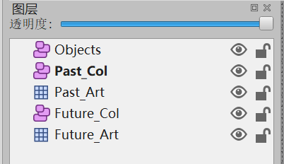
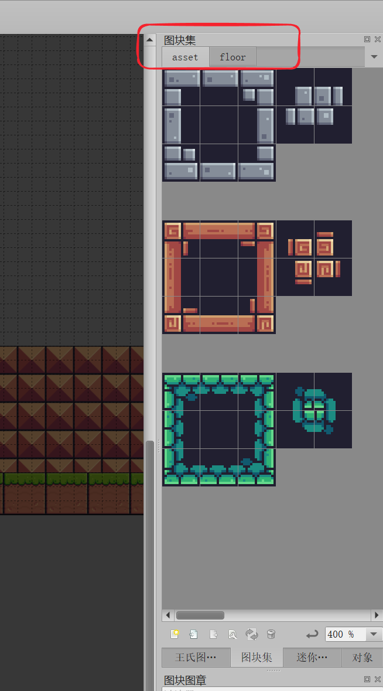
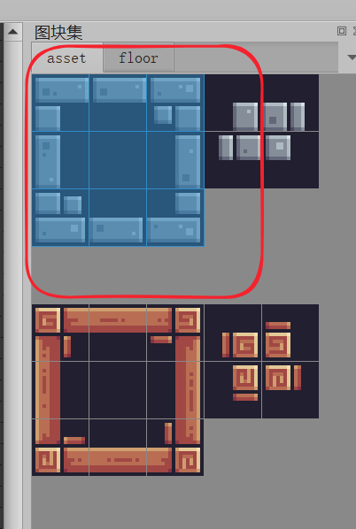
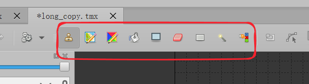
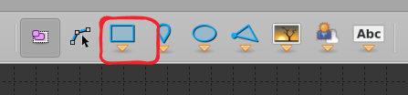
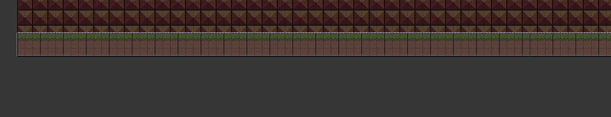
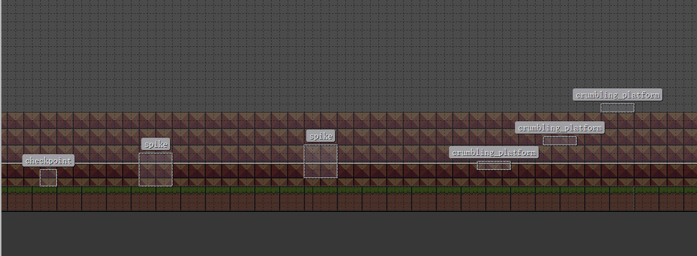
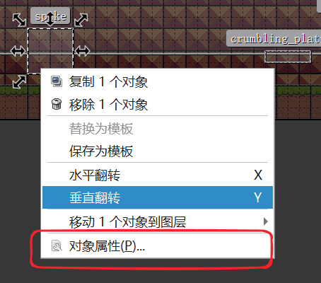
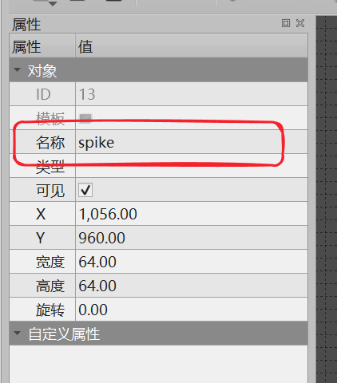

## Overview

---
图层
+ Objects（地图中的道具）
+ Past_Col（过去的碰撞箱）
+ Past_Art（过去的美术素材）
+ Future_Col（同理）
+ Future_Art（同理）

## 准备工作
使用`Tiled ver 1.4.3`

准备**图块集文件（.tsx）**并与创建的地图文件放在**相同路径**下。
在右侧加载图块集。

## 绘制美术素材
选择美术素材的**图层**。

鼠标拖动选择素材

选中工具进行**绘制**

## 添加碰撞体
选择碰撞体的**图层**。
> PS: 仅开启相同时间美术素材和碰撞体可见性，防止干扰。

一次性尽**可能多的**框选地板方块，提升性能表现。

> ！！！碰撞框千万别重叠，否则直接崩溃。

## 添加道具
选择**Object层**

添加适当大小的**矩形**，有碰撞箱的objects之间、和地板的碰撞箱，**不要重叠**。

选择**对象属性**

更改**名称**，游戏会自动生成道具。

名称-道具对应表

| 道具      | 名称                 | 是否有碰撞箱 |
| ------- | ------------------ | ------ |
| 古老碎石/桥梁 | crumbling_platform | 有      |
| 尖刺      | spike              | 有      |
| 存档点     | checkpoint         | 有      |
| 收集物     | collectible        | 无      |
| 勾点      | anchor             | 无      |
| 望远镜视域   | ViewZone           | 无      |
### 收集物添加教程
#### Tiled 配置要求
现在**必须**在 Tiled 中为每个收集物指定 `collectibleId` 属性：
#### 示例配置
**对象名称：** collectible
**自定义属性（Custom Properties）：**
| 属性名 | 类型 | 必需 | 示例值 | 说明 |
|--------|------|------|--------|------|
| `collectibleId` | String | ✅ 是 | `L1_C001` | 收集物唯一 ID，格式：`{关卡}_{类型}_{序号}` |
| `type` | String | ❌ 否 | `time_fragment` | 收集物类型，默认：time_fragment |

#### 推荐的 ID 命名规范
| ID 格式     | 示例               | 说明                         |
| --------- | ---------------- | -------------------------- |
| `L1_F001` | Level 1 第 1 个碎片  | L = Level, F = Fragment    |
| `L1_C005` | Level 1 第 5 个碎片  | L = Level, C = Collectible |
| `L2_F010` | Level 2 第 10 个碎片 | L = Level, F = Fragment    |

需要在**Cocos Creator**编辑的道具

- 简单敌人
- 追踪敌人
- 护盾
- 钩爪（可拾取道具）
- 望远镜
- 地火/激光
- 球障碍

---
视频资料 [Cocos+Tiled](https://www.bilibili.com/video/BV1cPLbzMER4)

